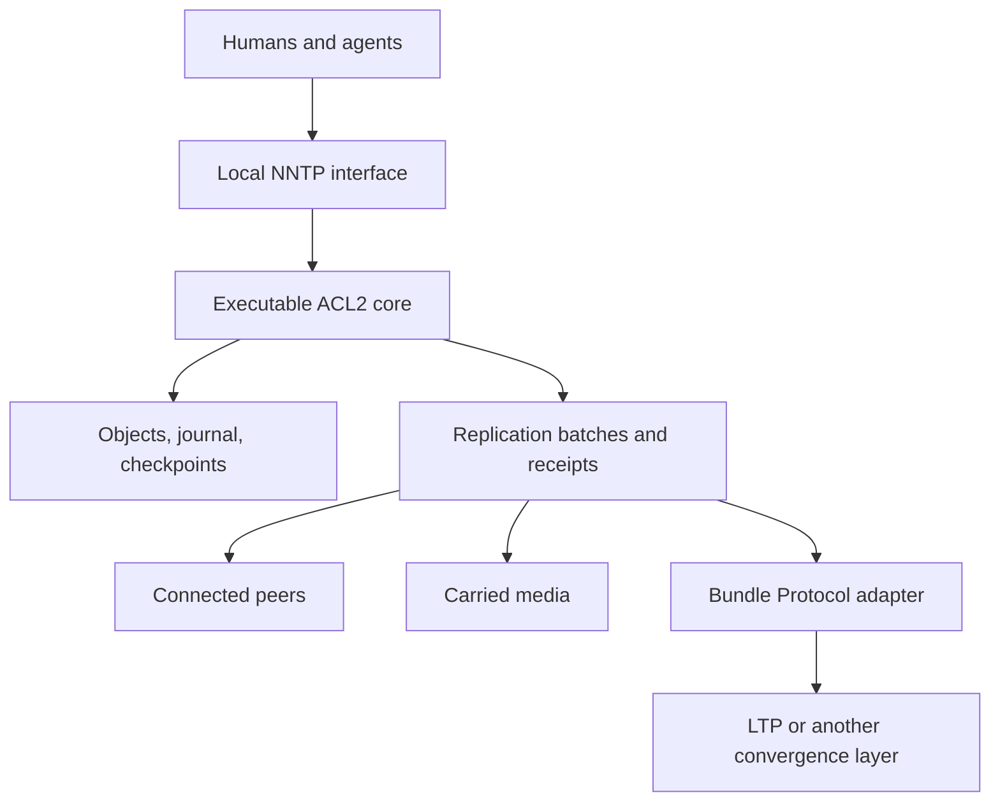

# Architecture

Status: agreed architectural direction with explicitly provisional realization
choices. See [decisions](../planning/decisions.md) for their individual status.

## Purpose

Provide a communications nexus for humans and AIs that remains useful when peers
are asleep, disconnected, far away, or reachable only by carried media. Articles
are ordinary news content. A site can accept local work without consulting a
remote quorum. Future extraterrestrial use motivates long-delay operation and
explicit resource accounting; it is not a current qualification claim.

The central questions are: what does this node have, why does it keep it, what
has it undertaken to do, and what evidence permits it to release that obligation?

## Composition

The core makes semantic decisions. A Common Lisp host performs socket and disk
operations, reports their outcomes, and supplies environmental observations.
The core does not receive arbitrary Lisp forms from a client. Its conceptual
interface is `step(state, event) -> (state', effects)`; the exact event schema is
an M1 deliverable, not an already frozen API.

The domain state is fn's state, not a requirement to thread ACL2's global `state`
through every definition. Clock readings, connection arrivals, and disk results
are explicit inputs. The core can therefore be executed against a simulator.

## Components and ownership

| Component | Owns |
| --- | --- |
| Article model | Source bytes, identity bindings, provenance, membership policy |
| News/session machine | Framing, commands, cursor transitions, response decisions |
| Storage machine | Transactions, committed state, recovery, checkpoint/compaction rules |
| Retention machine | Reservations, obligations, evidence, release eligibility |
| Replication machine | Inventories, batches, duplicate suppression, transfer progress |
| Host adapter | I/O, platform barriers, scheduling, primitive integration |
| Presentation clients | Thread rendering, MIME display, search UI, local drafts |

These are logical boundaries, not an initial requirement for separate processes.
The initial shared-state owner serializes mutations. Connections may receive
data concurrently and stage bounded inputs; they do not independently allocate
numbers or install snapshots. Only one shared-state transaction commits at a time.
Read responses observe a committed version; their referenced objects stay pinned
until the host finishes or cancels the response.

BPv7 is an active inter-node communication path, developed alongside the local
NNTP service. Its adapter separates protocol implementation and trust boundaries;
it does not postpone disconnected operation. Durable fn jobs, attempt identities,
inbound staging and application receipts are part of this path. See the
[BP integration contract](../specs/bp-path.md).

## Three representations

The logical model uses finite maps, records, sets, natural numbers, and octets.
The executable representation may use indexed arrays and abstract stobjs with
correspondence proofs. Persistent bytes follow a separately versioned format.
These layers must not accidentally define one another's identity or ordering.

Articles and statements are portable. Journal sequence numbers, disk offsets,
NNTP article numbers, cache contents, and filesystem paths are local.
Replication exchanges portable objects and statements, never raw database pages.

## Trust boundary

The intended proof subject is the executable core plus its specified codecs,
recovery, and storage algorithms. The initial trusted boundary includes ACL2,
its host Lisp/runtime, cryptographic primitive implementations, the I/O adapter,
and stated platform assumptions. Claims grow only as refinement and integration
evidence appear. See [failures](../specs/failures.md) and [proofs](proofs.md).

**The digest left that boundary on 2026-09-20.** `books/sha256.lisp` defines
FIPS 180-4 SHA-256 over octet lists as a total, guard-verified ACL2 function,
and `books/crypto-attach.lisp` attaches it to both digest seams — `fn-digest`
(`books/crypto-seam.lisp`) and `fn-frame-digest` (`books/frame-octets.lisp`) —
after discharging every constraint each `encapsulate` states. So the digest is
now **computed in logic by a proved-executable definition**: no host SHA-256
stands behind a content identity, an AUTHINFO verifier or a frame the core
reasons about, and the identity derivation has one owner. Agreement with the
standard is by evaluation against the published vectors
(`tests/acl2/sha256-tests.lisp`), which is evidence, not a proof that the
definition and the document agree on every input.

What remains assumed is unchanged and is stated as before: **collision
resistance and preimage resistance are A-CRYPTO** (`specs/failures.md`,
`books/assumptions.lisp`). `defattach` adds no axiom; it discharges the
constraints and makes ground terms evaluate, so every theorem that held of the
seam holds now, with the same hypotheses and no more. The seam's own local
witness is still the constant zero digest, and
`tests/acl2/crypto-seam-tests.lisp` still attaches a colliding toy realiser to
keep that visible. Signature verification remains trusted: `fn-sig-verify` and
`fn-anchor-sig-verify` stay constrained. The native anchor calls the libsodium
facility in `host/native/crypto.lisp`; `tools/crypto_host.py` belongs to the
development adapter. That primitive integration does not select D09's native
article-signature profile, and the digest proof says nothing about signatures.

**SHA-512 has not left the boundary, and the freshness anchor names what it
still trusts.** There is no SHA-512 anywhere in `books/`: `books/sha256.lisp`
is the only hash in logic and Roughtime's Merkle fold is SHA-512. So
`fn-anchor-leaf-digest` (`books/anchor.lisp`) is constrained to "64 octets"
and nothing else; no book attaches a realiser to it. Native
`fnn-crypto-anchor-leaf` supplies SHA-512 of `0x00 || nonce`; the development
adapter uses `tools/roughtime.py`'s `_leaf`. Their agreement with
`fn-anchor-leaf-digest` remains a trusted correspondence, like host Ed25519's
agreement with `fn-anchor-sig-verify`. ACL2 owns the bounded response parser,
exact signed subjects and one-nonce policy. Nonempty Merkle paths remain
unsupported and do not become accepted durable anchors. The native acquisition
and persistence components have [scoped evidence](../tests/evidence/2026-09-21-native-anchor-replace.md);
this is not general Roughtime interoperability or platform qualification.
See D22 and [the anchor specification](../specs/anchor.md).

**TLS remains a host facility.** RFC 4642 STARTTLS is served by
`books/nntp-auth.lisp`, which sees plaintext octets on both sides of the
handshake: it answers 382 and emits a `(:starttls)` effect. The native owner
uses OpenSSL 3 through `host/native/tls.lisp`; the development adapter uses
Python's `ssl`. No theorem in this tree says anything about confidentiality,
integrity, certificate validation, cipher selection or the handshake itself.
The native OpenSSL library, dynamic loader, C ABI, socket BIO and the
sole-reader `MSG_PEEK`/consume premise are explicit trust.

ACL2 owns the protocol state machine around that facility: that a handshake is
owed only from the branch that answered 382, that later bytes in the same
observation are never framed as NNTP, and when the TLS layer is recorded. The
native host calls `fn-ocfg-read-tls-prefix` once, consumes its exact prefix,
lets OpenSSL read the suffix, and supplies `(:tls-established)` only after
`SSL_accept` succeeds. The owner then checks `SSL_pending` before waiting on
the raw descriptor so already decrypted plaintext is not stranded. The
AUTHINFO secret still crosses an unprotected connection in the clear, which
is what RFC 4643 §2.3's mechanism is, and `[auth] protected_only` makes the
ACL2 session refuse it until the per-connection layer is active.

Stored evidence is not automatically authority. An untrusted article cannot
change configuration, authorize a new peer, erase another article, or create a
retention obligation simply by naming it. The policy version and authorization
context of acceptance must be recoverable.

## Product boundaries

The first usable site has configured unmoderated groups, a complete planned
NNTP reader/posting surface, and all accepted visible articles retained. BP-backed disconnected exchange
proceeds alongside this local service under the same acceptance and retention
contracts. D17 selects NNTP and command-line clients first; a web reader/composer
comes later. 9p views, private correspondence and moderation are also later
interfaces or policy features. D01 fixes the native source boundary: exact
authored bytes are signed, with mutable NNTP trace and gateway injection records
in separate projections. Concrete native encoding and key profiles remain open.

Human/agent identity is a principal with recorded provenance and authorization.
The `From` header is presentation content, not authentication. The first deployment
profile will define how local users and peers authenticate; it is open, and this
scaffold does not authorize opening a public listener.
