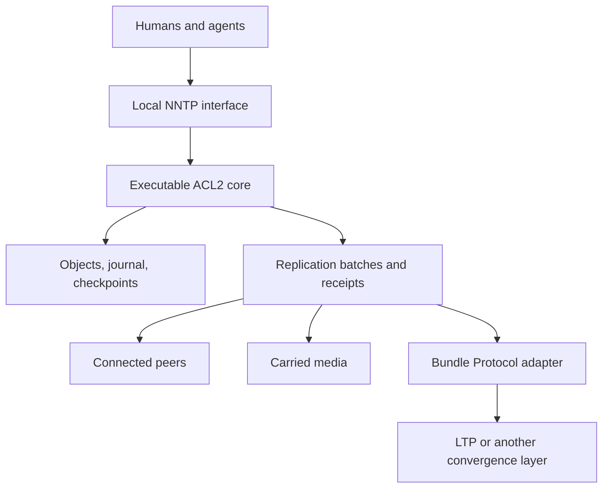

# Architecture

Status: agreed architectural direction with explicitly provisional realization
choices. See [decisions](../planning/decisions.md) for their individual status.

## Purpose

Provide a communications nexus for humans and AIs that remains useful when peers
are asleep, disconnected, far away, or reachable only by carried media. Articles
are ordinary news content. A site can accept local work without consulting a
remote quorum. Future extraterrestrial use motivates long-delay operation and
explicit resource accounting; it is not a current qualification claim.

The central questions are: what does this node have, why does it keep it, what
has it undertaken to do, and what evidence permits it to release that obligation?

## Composition

The core makes semantic decisions. A Common Lisp host performs socket and disk
operations, reports their outcomes, and supplies environmental observations.
The core does not receive arbitrary Lisp forms from a client. Its conceptual
interface is `step(state, event) -> (state', effects)`; the exact event schema is
an M1 deliverable, not an already frozen API.

The domain state is fn's state, not a requirement to thread ACL2's global `state`
through every definition. Clock readings, connection arrivals, and disk results
are explicit inputs. The core can therefore be executed against a simulator.

## Components and ownership

| Component | Owns |
| --- | --- |
| Article model | Source bytes, identity bindings, provenance, membership policy |
| News/session machine | Framing, commands, cursor transitions, response decisions |
| Storage machine | Transactions, committed state, recovery, checkpoint/compaction rules |
| Retention machine | Reservations, obligations, evidence, release eligibility |
| Replication machine | Inventories, batches, duplicate suppression, transfer progress |
| Host adapter | I/O, platform barriers, scheduling, primitive integration |
| Presentation clients | Thread rendering, MIME display, search UI, local drafts |

These are logical boundaries, not an initial requirement for separate processes.
The initial shared-state owner serializes mutations. Connections may receive
data concurrently and stage bounded inputs; they do not independently allocate
numbers or install snapshots. Only one shared-state transaction commits at a time.
Read responses observe a committed version; their referenced objects stay pinned
until the host finishes or cancels the response.

## Three representations

The logical model uses finite maps, records, sets, natural numbers, and octets.
The executable representation may use indexed arrays and abstract stobjs with
correspondence proofs. Persistent bytes follow a separately versioned format.
These layers must not accidentally define one another's identity or ordering.

Articles and statements are portable. Journal sequence numbers, disk offsets,
NNTP article numbers, cache contents, and filesystem paths are local.
Replication exchanges portable objects and statements, never raw database pages.

## Trust boundary

The intended proof subject is the executable core plus its specified codecs,
recovery, and storage algorithms. The initial trusted boundary includes ACL2,
its host Lisp/runtime, cryptographic primitive implementations, the I/O adapter,
and stated platform assumptions. Claims grow only as refinement and integration
evidence appear. See [failures](../specs/failures.md) and [proofs](proofs.md).

Stored evidence is not automatically authority. An untrusted article cannot
change configuration, authorize a new peer, erase another article, or create a
retention obligation simply by naming it. The policy version and authorization
context of acceptance must be recoverable.

## Product boundaries

The first usable site has configured unmoderated groups, a complete planned
NNTP reader/posting surface, and all accepted visible articles retained. A web
reader, 9p views, private correspondence, moderation, and DTN adapters are later
interfaces or policy features. Their eventual addition must reuse acceptance
and retention contracts.

Human/agent identity is a principal with recorded provenance and authorization.
The `From` header is presentation content, not authentication. The first deployment
profile will define how local users and peers authenticate; it is open, and this
scaffold does not authorize opening a public listener.
