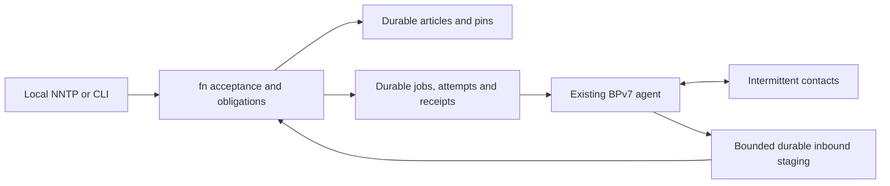

# BPv7 is a current architectural path

Status: the user clarified on 2026-09-18 that the capabilities supplied by BP
are central to fn, not an optional late interface. This changes sequencing;
it does not select a cryptographic suite, native signing grammar, production
BP implementation, endpoint namespace, or flight qualification profile.

The first [actual BPv7 transport experiment](../tests/evidence/2026-09-18-bpv7-transport.md)
has passed with a pinned dtn7-rs build. It queued through disconnection, survived
clean restart, rediscovered inbound storage, and exercised non-destructive staging
and explicit deletion. Application workflow/receipt integration is still active.

## Product shape

NNTP is a local human/agent interface. The fn core owns article identity,
source/provenance, application acceptance, retention obligations and release
evidence. BPv7 is an active inter-node communication path across interrupted,
delayed and asymmetric contacts. A BP implementation owns bundle routing,
forwarding and convergence-layer operation. LTP is a relevant convergence-layer
path to exercise after the first BP application seam; TCP-based laboratory
interoperability does not establish LTP or space-link qualification.

Keep the BP implementation behind a narrow adapter because it is a separate
trust and interoperability boundary. Exercise that boundary early. BP-backed
exchange must not wait for complete NNTP, disk indexes, compaction or a web UI.
Portable fn units can also traverse carried media under the same ingestion and
receipt rules; a live interactive conversation is not a prerequisite to import.

Bundle transport observations return to the job machine. Only checked,
durably recorded application evidence reaches the obligation-release decision.

## State that belongs to fn

The existing article-only transaction format is insufficient for this path.
The next local experiment therefore needs a versioned durable workflow journal,
without pretending that it freezes the eventual native/portable object format.

- **Enqueue transaction:** bind a work identity to an already committed article
  and its immutable subject/archive obligation, a configured peer endpoint,
  scope and terms. A separately acknowledged enqueue is permitted; the existing
  local post promises archive retention and does not secretly promise forwarding.
  A later combined post-and-forward API must commit both promises atomically.
- **Submission intent:** persist work/attempt identity and generation before
  calling the bundle protocol agent (BPA). A lost API reply or process restart
  means uncertain submission. Retry may create another bundle carrying the same
  fn identity; it must not create another accepted article or retention charge.
- **Inbound staging:** establish exactly when the selected BPA removes its
  retained copy. A destructive receive API before durable fn staging creates a
  crash-loss window and cannot be called restart-safe. Bound staged payloads and
  reserve capacity before accepting obligations.
- **Application acceptance:** validate the fn payload and configured authority,
  then commit content plus accepted terms. Receipt identity, subject, issuer,
  scope, incarnation and policy context must survive restart. Regenerate a lost
  receipt from durable accepted facts rather than accepting a second obligation.
- **Release decision:** only the obligation's checked application evidence can
  authorize a locally committed release. A BPA submit result, transport ACK,
  bundle status report, deletion or expiry cannot perform this transition.

Bundle attempts have finite transport lifetimes. fn's indefinite archive policy
does not expire with them. An expired/deleted attempt leaves the fn job and its
protecting obligation intact; retry policy determines a later submission when
resources and contacts permit. Monotonic observations, uncertain wall clocks,
and origin/incarnation reuse need explicit contracts.

## First complete experimental slice

Use a pinned existing BPv7 implementation and loopback-only laboratory endpoints.
The payload/profile is explicitly experimental until D01/D09 are selected.

1. Accept an article at node A and durably enqueue it for node B.
2. Remove the contact. Restart A and its BPA. Work remains queued or recoverably
   uncertain, without changing the article, local allocations or archive pin.
3. Restore contact and transmit an actual BPv7 ADU. B durably stages and validates
   it, then accepts under its own local numbering and retention rules.
4. Lose an application receipt, restart B, and retransmit. B recognizes the same
   application identity and regenerates its durable receipt without multiplying
   acceptance or charges.
5. Deliver matching authorized application evidence to A and commit the decision.
   Independent archive retention remains protected. Until authentication is
   integrated, a trusted local test policy demonstrates only that declared scope.
6. Repeat with a bundle expiry, duplicate/reordered delivery, full staging quota,
   uncertain submission, clock error and an inbound delivery interruption.

Run a later A–relay–B contact plan with non-overlapping contact windows, and
carried-media import through the same fn acceptance boundary. The first two-node
test is not proof of arbitrary topology, liveness, or mission operation.

## Parallel ownership and evidence

- Existing BPA build/API/interoperability and receive/dequeue persistence audit:
  Terra host lane.
- Executable ACL2 job/attempt/evidence state and trace invariants: Sol core lane.
- Actual workflow journal, replay bridge and crash/fault harness: Sol host lane.
- Legacy article parsing, configured routing and actual store ingress: Terra lane.
- Integration, contract alignment and registry accuracy: root.

Required safety results include state/accounting preservation; durable intent
before submission; stale-attempt rejection; unchanged application obligations
under every transport event; uncertain recovery without fabricated acceptance;
duplicate application idempotence; receipt-to-subject/terms binding; and
preservation of independent archive pins. These contribute to PRF-001/004/007/
011/012/013/014/017, without prematurely closing their broader statements.

REP-003/005/006 and SCN-001/007/008/010/011/017 exercise the actual disconnected
path. Conditional progress remains PRF-018 with explicit contact, capacity,
survival and fairness hypotheses. The existing 75-root batch is historical
evidence for its frozen source set, not evidence that these new tasks are done.

## Primary protocol references

- [RFC 9171, sections 3 and 5](https://www.rfc-editor.org/rfc/rfc9171.html): BPv7
  service, delivery and forwarding boundaries.
- [RFC 9171, sections 4.3.1 and 4.4.2](https://www.rfc-editor.org/rfc/rfc9171.html#section-4.3.1):
  bundle lifetime and bundle-age handling.
- [RFC 9171, section 6.1](https://www.rfc-editor.org/rfc/rfc9171.html#section-6.1):
  bundle status reports; these are not fn retention undertakings.
- [RFC 5326](https://www.rfc-editor.org/rfc/rfc5326.html): LTP link operation;
  reliability here does not imply application acceptance.
- [DTN7 implementation](https://github.com/dtn7/dtn7-rs) and
  [ION implementation](https://github.com/nasa-jpl/ION-DTN): candidate existing
  BPA integrations; exact revision/configuration and actual behavior need tests.
