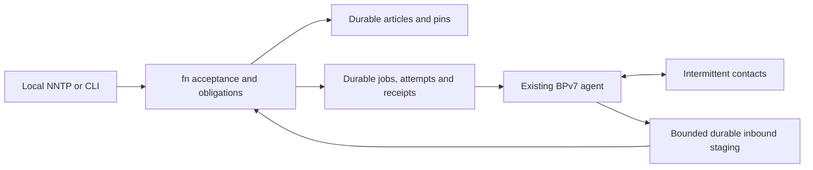

# BPv7 is a current architectural path

Status: the user clarified on 2026-09-18 that the capabilities supplied by BP
are central to fn, not an optional late interface. This changes sequencing;
it does not select a cryptographic suite, native signing grammar, production
BP implementation, endpoint namespace, or flight qualification profile.

The first [actual BPv7 transport experiment](../tests/evidence/2026-09-18-bpv7-transport.md)
has passed with a pinned dtn7-rs build. It queued through disconnection, survived
clean restart, rediscovered inbound storage, and exercised non-destructive staging
and explicit deletion. This first run covered transport rather than application acceptance.
The next [actual BP-to-fn receiver test](../tests/evidence/2026-09-18-bp-ingress.md)
also passed: receiver restart, exact article acceptance and a new-BID duplicate
leave one recovered article/archive pin. That earlier run used a BPA fixture sender; the later complete experiment below
adds durable fn sender work and receipt regeneration.
The [bounded BPA boundary](../tests/evidence/2026-09-18-bpa-boundary.md) now caps
raw downloads and extracted ADUs before the article path; the pinned upstream
BP decoder remains an explicit trusted component.

The [complete application exchange](../tests/evidence/2026-09-18-bp-exchange.md)
now passes with actual durable fn sender work, receiver acceptance and decision,
lost receipt, process restart, duplicate recognition, receipt regeneration and
real BP return transport. Both nodes retain one article/archive pin. Explicit
fn retry also recovers uncertain BPA forwarding after restart; inventory alone
does not prove forwarding readiness. These results supersede the fixture-sender
boundary above, within the unsigned trusted-loopback profile.

## Product shape

NNTP is a local human/agent interface. The fn core owns article identity,
source/provenance, application acceptance, retention obligations and release
evidence. BPv7 is an active inter-node communication path across interrupted,
delayed and asymmetric contacts. A BP implementation owns bundle routing,
forwarding and convergence-layer operation. LTP is a relevant convergence-layer
path to exercise after the first BP application seam; TCP-based laboratory
interoperability does not establish LTP or space-link qualification.

That LTP seam has now been exercised once. A pinned ION-DTN build carried an
actual fn request ADU over LTP/UDP and fn's receiver accepted it; interruption
and expiry behaved as this spec requires. The
[feasibility evidence](../tests/evidence/2026-09-19-ltp-feasibility.md) and
[packet](../planning/ltp-feasibility.md) record two blockers before an LTP
profile is possible: ION has no non-destructive receive, so an app-level durable
staging copy is mandatory and its delete is fn's own; and ION returns no bundle
identifier to the sending application, so a durable attempt has no transport
handle to bind and the receipt return leg was not attempted. This is
feasibility, not interoperability qualification and not a mission profile.

Keep the BP implementation behind a narrow adapter because it is a separate
trust and interoperability boundary. Exercise that boundary early. BP-backed
exchange must not wait for complete NNTP, disk indexes, compaction or a web UI.
Portable fn units can also traverse carried media under the same ingestion and
receipt rules; a live interactive conversation is not a prerequisite to import.

Bundle transport observations return to the job machine. Only checked,
durably recorded application evidence reaches the obligation-release decision.

## State that belongs to fn

The existing article-only transaction format is insufficient for this path.
The [sender workflow adapter](bp-workflow-host.md) therefore uses a versioned
durable journal alongside article storage. Its local records do not freeze the
eventual native/portable object format.

- **Enqueue transaction:** bind a work identity to an already committed article
  and its immutable subject/archive obligation, a configured peer endpoint,
  scope and terms. A separately acknowledged enqueue is permitted; the existing
  local post promises archive retention and does not secretly promise forwarding.
  A later combined post-and-forward API must commit both promises atomically.
- **Submission intent:** persist work/attempt identity and generation before
  calling the bundle protocol agent (BPA). A lost API reply or process restart
  means uncertain submission. Retry may create another bundle carrying the same
  fn identity; it must not create another accepted article or retention charge.
- **Inbound staging:** establish exactly when the selected BPA removes its
  retained copy. A destructive receive API before durable fn staging creates a
  crash-loss window and cannot be called restart-safe. Bound staged payloads and
  reserve capacity before accepting obligations.
- **Application acceptance:** validate the fn payload and configured authority,
  then commit content plus accepted terms. Receipt identity, subject, issuer,
  scope, incarnation and policy context must survive restart. Regenerate a lost
  receipt from durable accepted facts rather than accepting a second obligation.
- **Release decision:** only the obligation's checked application evidence can
  authorize a locally committed release. A BPA submit result, transport ACK,
  bundle status report, deletion or expiry cannot perform this transition.

Bundle attempts have finite transport lifetimes. fn's indefinite archive policy
does not expire with them. An expired/deleted attempt leaves the fn job and its
protecting obligation intact; retry policy determines a later submission when
resources and contacts permit. Monotonic observations, uncertain wall clocks,
and origin/incarnation reuse need explicit contracts.

## First complete experimental slice

Use a pinned existing BPv7 implementation and loopback-only laboratory endpoints.
The payload/profile is explicitly experimental until D01/D09 are selected.

1. Accept an article at node A and durably enqueue it for node B.
2. Remove the contact. Restart A and its BPA. Work remains queued or recoverably
   uncertain, without changing the article, local allocations or archive pin.
3. Restore contact and transmit an actual BPv7 ADU. B durably stages and validates
   it, then accepts under its own local numbering and retention rules.
4. Lose an application receipt, restart B, and retransmit. B recognizes the same
   application identity and regenerates its durable receipt without multiplying
   acceptance or charges.
5. Deliver matching authorized application evidence to A and commit the decision.
   Independent archive retention remains protected. Until authentication is
   integrated, a trusted local test policy demonstrates only that declared scope.
6. Repeat with a bundle expiry, duplicate/reordered delivery, full staging quota,
   uncertain submission, clock error and an inbound delivery interruption.

## Native application join

The native receive command joins the TCPCL session, BP bundle decoder, writable
owner and FNRJ receipt journal in one process.  Its TCPCL callback is an actual
application entry point, not an archive-only diagnostic: an accepted bundle ADU
is decoded as one `fn-bpa` request and submitted through the same live owner
Store transition used by served and control posting.  The owner mutex covers the
application transition.  The callback never opens a standalone Store image and
never reads a raw epoch in place of the owner's configuration generation.

The durable order for a new request is:

1. Publish `(:request-intent inbound-id exact-request-adu owner-generation
   owner-next-txid planned-result)` to FNRJ. `planned-result` is `:accepted`
   only after authoritative Store lookup observes no candidate; it is
   `:duplicate` only after that lookup observes one exact committed candidate.
2. Ask the owner for the exact Message-ID, groups, article, BP provenance,
   configuration generation and transaction id, then publish its existing feed
   submission intent.
3. Execute the owner's Store attempt, publish its feed commit or abort, and
   apply the control completion.
4. Publish FNRJ `:request-context-v2` with the original inbound identity,
   exact request, exact committed Store record, pinned owner generation,
   record transaction/generation and application result chosen by ACL2, then
   publish receipt intent and committed decision.
5. Regenerate the receipt ADU from the committed FNRJ state, author its BP
   bundle through the BP node machine, and only then offer that bundle to TCPCL.

These are separate facts.  TCPCL's XFER_ACK acknowledges a durable inbound
transfer.  The owner completion says whether the article and archive pin were
accepted.  The FNRJ decision authorizes an application receipt.  None is
substituted for another.

`request-intent` is appended to the version-1 FNRJ kind table, so existing kind
codes and record bytes retain their meaning.  Replay accepts a legacy
context-first prefix until the first request intent.  From that point the
journal is strict: every request context binds one byte-identical pending
intent with the same inbound identity and preserves that binding for replay;
a conflicting retry or unmatched context faults recovery.  An intent by itself
proves no Store acceptance.  A retry may arrive in another transport bundle,
but it cannot replace the original inbound identity or planned result.

Recovery obtains a Store record only from the recovered live owner's history.
The ACL2 lookup compares the parsed Message-ID, exact article, immutable subject,
transaction id and configuration generation.  No candidate is `:absent`, one
matching committed candidate is `:found`, and multiple or conflicting candidates
are `:conflict`; the host never chooses the first record in a directory scan.

The executable states distinguish cuts after request intent, owner/feed intent,
Store publication, feed resolution, request context, receipt intent, receipt
decision and receipt transmission.  Before Store publication, recovery may
retry the same pending request.  After Store publication it binds the recovered
record and never creates another article or archive pin.  A receipt intent with
no visible decision is resolved absent after authoritative journal recovery and
may be prepared again.  A committed decision regenerates identical receipt
bytes after restart, including when the earlier receipt bundle was sent and
lost.  Any ambiguous Store, FNFD or FNRJ persistence observation fences the
whole owner process and emits no accepted receipt.

The native death witness currently covers the committed-decision cut before
receipt authorship.  The ACL2 context transition and dispatcher theorems are
local branch projections.  A trace invariant connecting every FNRJ replayed
intent/context/decision to the evolving canonical owner Store, plus actual host
correspondence at the remaining cuts, is still open assurance work.

Run a later A–relay–B contact plan with non-overlapping contact windows, and
carried-media import through the same fn acceptance boundary. The first two-node
test is not proof of arbitrary topology, liveness, or mission operation.

## The carried-media path

Carried media is a transport with a very long round-trip time, not a second
acceptance path. A media directory is `manifest.json` plus one file per bundle
under `bundles/`; the manifest names each bundle's transport identity, its
octet count and a copy digest, and the exporter writes the manifest last so an
interrupted copy is not a media that silently under-reports what it carries.
`tools/media.py` exports by asking ACL2 for the exact request ADU of each
durable outbound work (`fn-bpo-host-request-adu`) and imports by handing a
read-only view of that directory to the *same* callbacks the network receiver
takes: `WorkflowJournal.stage_inbound` bounds and durably stages the bundle,
and `run_bp_receive.receive_bpa_request` decides acceptance, receipt, charge
and local number. Python adds no semantics on either side.

- **The copy digest is a copy check, never an identity.** It refuses damaged
  bytes before they can be staged. Content identity, immutable subject,
  archive obligation and receipt identity stay ACL2's, derived from the ADU
  after staging exactly as for a bundle downloaded from a BPA. A digest that
  matches buys an item nothing beyond a staging attempt.
- **The media is read-only.** Every read uses one `O_RDONLY | O_NOFOLLOW`
  descriptor and no path under the media root is opened for writing, so the
  same volume can be re-imported or carried onward. What the BPA `delete` step
  means here is a durable *consumption* record beside the importing node's own
  journals; it is transport bookkeeping and never an acceptance event.
- **The outcomes stay distinct and whole.** A partial copy is absent from the
  inventory rather than short, and is refused; a same-length corruption is
  refused by the copy digest before staging; an exhausted staging or store
  quota is the receiver's own refusal, with nothing charged; an ambiguous
  staging or publication is reported `uncertain`, never as a refusal. An item
  is accepted whole through the receiver or it changes no acceptance, receipt
  or pin at all. Re-importing a volume a node has already accepted is a
  duplicate that regenerates the same receipt bytes.

`tests/bp-dtn7/run_four_node_lab.py` runs `home -> relay-a -> relay-b ->
destination` with non-overlapping contact windows and one carried-media hop
(relay-a to relay-b), over `tests/bp-dtn7/mock_bpa.py` when `DTN7_REPO` is
unset. Its record is [the four-node lab](../tests/evidence/2026-09-20-four-node-lab.md).
A relay there is receiver-then-sender through two separate host paths: the
receiver accepts and archives, and an onward sender work is then enqueued for
the same committed article. That is the manually reenqueued archival relay of
[the relay undertaking](relay.md); the host emits no relay receipt *kind*, so
`books/relay.lisp`'s `:forwarding` undertaking and its proposed FNWF
`(:relay-undertaking upstream onward)` record remain a proposal and no accepted
forwarding responsibility is demonstrated.

## Parallel ownership and evidence

- Existing BPA build/API/interoperability and receive/dequeue persistence audit:
  Terra host lane.
- Executable ACL2 job/attempt/evidence state and trace invariants: Sol core lane.
- Actual workflow journal, replay bridge and crash/fault harness: Sol host lane.
- Legacy article parsing, configured routing and actual store ingress: Terra lane.
- Integration, contract alignment and registry accuracy: root.

Required safety results include state/accounting preservation; durable intent
before submission; stale-attempt rejection; unchanged application obligations
under every transport event; uncertain recovery without fabricated acceptance;
duplicate application idempotence; receipt-to-subject/terms binding; and
preservation of independent archive pins. These contribute to PRF-001/004/007/
011/012/013/014/017, without prematurely closing their broader statements.

REP-003/005/006 and SCN-001/007/008/010/011/017 exercise the actual disconnected
path. Conditional progress remains PRF-018 with explicit contact, capacity,
survival and fairness hypotheses. The existing 75-root batch is historical
evidence for its frozen source set, not evidence that these new tasks are done.

## Primary protocol references

- [RFC 9171, sections 3 and 5](https://www.rfc-editor.org/rfc/rfc9171.html): BPv7
  service, delivery and forwarding boundaries.
- [RFC 9171, sections 4.3.1 and 4.4.2](https://www.rfc-editor.org/rfc/rfc9171.html#section-4.3.1):
  bundle lifetime and bundle-age handling.
- [RFC 9171, section 6.1](https://www.rfc-editor.org/rfc/rfc9171.html#section-6.1):
  bundle status reports; these are not fn retention undertakings.
- [RFC 5326](https://www.rfc-editor.org/rfc/rfc5326.html): LTP link operation;
  reliability here does not imply application acceptance.
- [DTN7 implementation](https://github.com/dtn7/dtn7-rs) and
  [ION implementation](https://github.com/nasa-jpl/ION-DTN): candidate existing
  BPA integrations; exact revision/configuration and actual behavior need tests.
